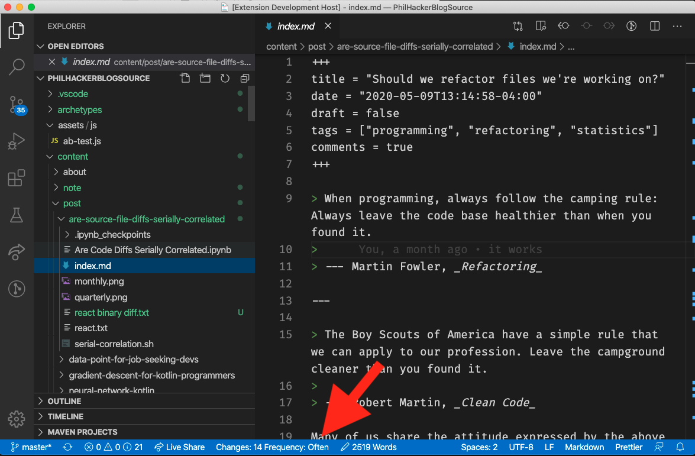

# Change Score

This plugin helps you find the most useful refactorings you can perform on your codebase. Each time you open a file in vscode, it displays the number of times the file has changed, _along with the how frequently its changed relative to other files in the codebase._

## Features

Change score information is displayed in the status bar:

## Why?

Because [refactoring code that won't be changed in the future isn't very useful](https://www.philosophicalhacker.com/post/calculing-expected-utility-for-a-refactor/) and [source file diffs may not be strongly serially correlated](https://www.philosophicalhacker.com/post/are-source-file-diffs-serially-correlated/)

## Release Notes

### 0.1

Initial release

---
